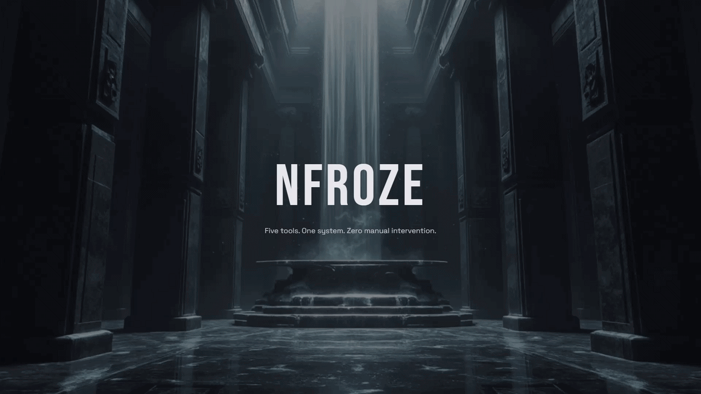

# Nexus

**Live:** [nfroze.co.uk](https://nfroze.co.uk)

Cinematic scroll-driven showcase for five DevSecOps webapps, served as the front door to the NFROZE collection at [nfroze.co.uk](https://nfroze.co.uk).

## Overview

Security tooling often struggles with discoverability. Individual tools get built, deployed, and forgotten in separate repos. Nexus solves this by presenting five production DevSecOps applications — Sentinel, Oracle, Bastion, Aegis, and Verdant — as a unified collection through a single immersive scroll experience.

The site is an 8-section single-page application built with React 19 and GSAP ScrollTrigger. Each of the five apps is revealed in its own colour world as the user scrolls, with looped video recordings autoplaying inside glassmorphic panels that dissolve and scale to fill the viewport. A cinematic splash overlay with a vault-door split animation and synchronised ambient audio sets the tone on entry. The entire experience is scroll-reversible — every animation plays backwards when scrolling up.

This project was produced through an automated end-to-end pipeline: brief, hero art, cinemagraph, build spec, deployed webapp. One shot. No manual intervention.

## Architecture

Fully static. No backend, no database, no API calls.

React 19 renders eight scroll sections into a GSAP ScrollSmoother wrapper that provides buttery-smooth native scrolling. Each of the five app showcase sections uses ScrollTrigger with `pin: true` and `scrub: true` to map a two-phase animation sequence — glassmorphic reveal, then immersive full-screen expansion — directly to scroll position across 200% viewport height of pin duration.

Cross-section colour transitions animate CSS custom properties (`--accent-color`, `--glow-color`) via GSAP as the user scrolls between app sections, creating atmospheric gradient bleeds between each app's identity. Videos are lazy-loaded through ScrollTrigger callbacks — `play()` on enter, `pause()` on leave — keeping six simultaneous video elements performant.

Terraform provisions S3 static website hosting with a public read bucket policy and a Cloudflare proxied CNAME for SSL termination. Built assets deploy via `aws s3 sync`; media files (MP4, MP3) upload directly to S3 outside of git.

## Tech Stack

**Frontend:** React 19, TypeScript (strict mode), Tailwind CSS v4, Vite 7

**Animation:** GSAP ScrollTrigger, ScrollSmoother, `@gsap/react` hooks

**Audio:** Ambient background track with programmatic fade-in/fade-out via `setInterval` volume ramping

**Infrastructure:** Terraform (AWS S3 static hosting, Cloudflare DNS + SSL)

**Design:** Dark glassmorphism, Bebas Neue display type, monochrome obsidian palette with per-app accent colour worlds

## Key Decisions

- **Scroll-scrubbed animation over time-based:** Tying every showcase animation to scroll position (`scrub: true`) gives the user complete control. Scrolling up fully reverses the sequence — no trapped states, no waiting for animations to finish. The only time-based animation is the initial splash-to-hero entrance, which is deliberately cinematic and synchronised to an audio drop.

- **Two-phase pinned reveal per app:** Each app section pins for 200% viewport height, splitting into a glassmorphic panel reveal (0-50%) and a full-screen immersion (50-100%). The panel's borders, blur, and border-radius animate to zero while the video scales to fill the viewport via `transform: scale()` — creating the illusion of the frame dissolving around the content.

- **CSS custom properties for colour transitions:** Rather than swapping class names or re-rendering, GSAP animates CSS custom properties on `:root` to bleed each app's accent colour into the background. This keeps colour transitions atmospheric and avoids layout thrashing across six sections.

- **S3 + Cloudflare over CloudFront:** Cloudflare's proxied CNAME provides free SSL termination, caching, and DDoS protection without provisioning a CloudFront distribution or ACM certificate. Infrastructure cost stays under $1/month for a media-heavy static site.

## Built By

**Jarvis** — AI build system designed by [Noah Frost](https://noahfrost.co.uk)

This project was produced through an automated end-to-end pipeline: brief, hero art, cinemagraph, build spec, deployed webapp. One shot. No manual intervention.

&rarr; System architect: [Noah Frost](https://noahfrost.co.uk)
&rarr; LinkedIn: [linkedin.com/in/nfroze](https://linkedin.com/in/nfroze)
&rarr; GitHub: [github.com/nfroze](https://github.com/nfroze)
